# Color Theory: Learn The Art and Science of Colors

> [Udemy Course](udemy.com/course/color-theory-learn-the-art-and-science-of-colors)

## Basic of Colors

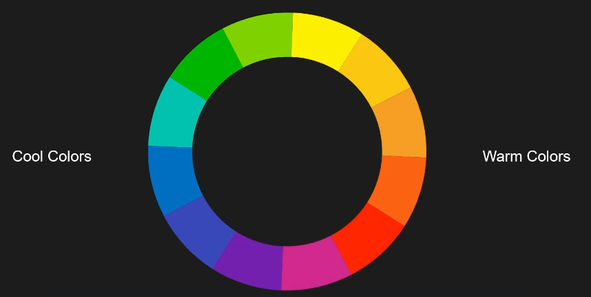

*Color Wheel*.

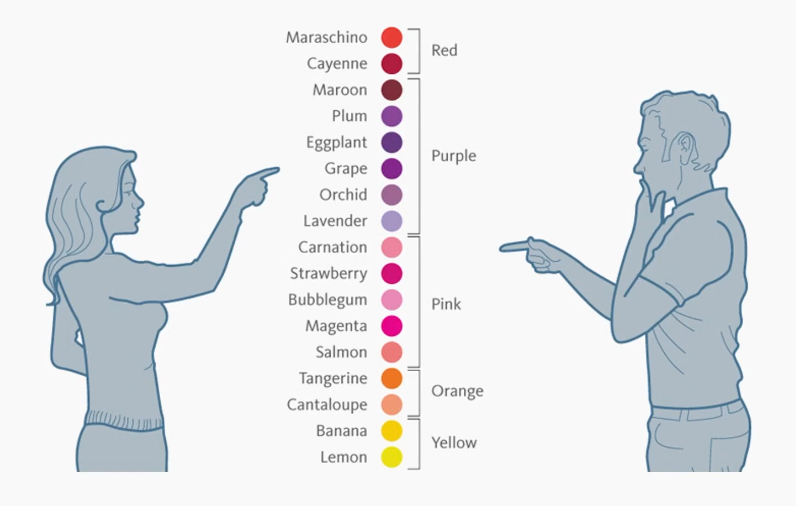

*Color perseption by gender*.

## Color properties and Harmonies

Color properties:

- Hue =  Color,
- Saturation = Intensity, and
- Value = Brightness

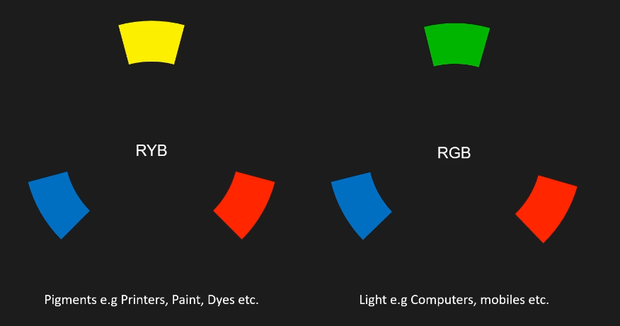

*RYB and RGB*.

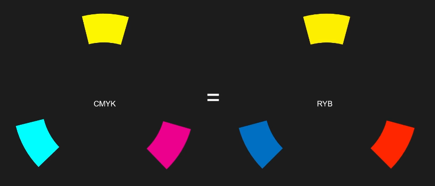

*CMYK and RYB*.

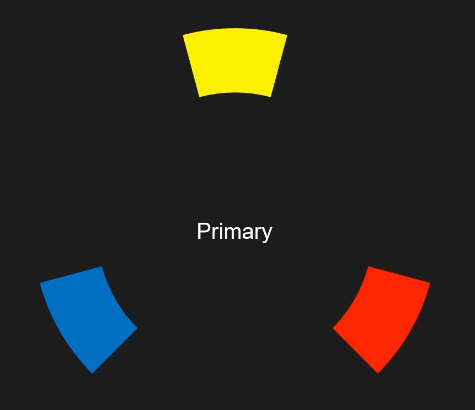

*Primary Colors*.

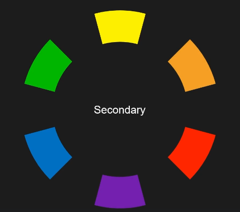

*Secondary Colors*.

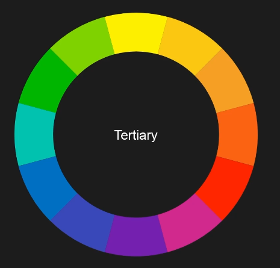

*Tertiary Colors*.

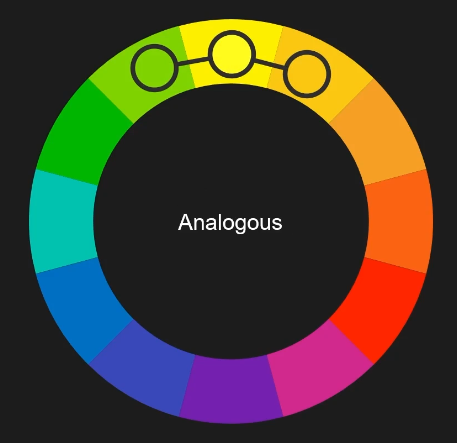

*Analogous*.

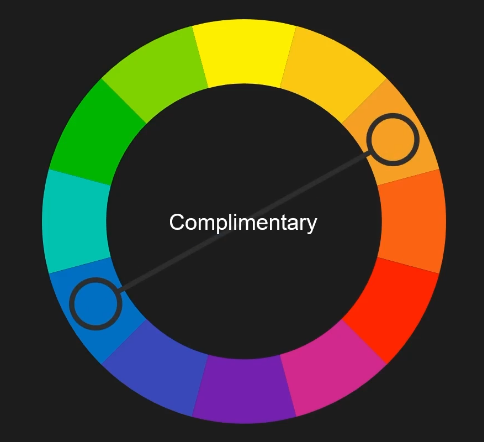

*Complimentary*.

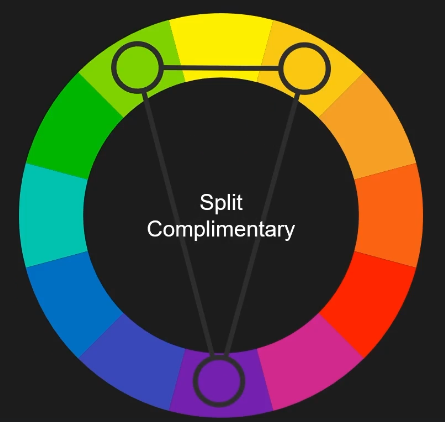

*Split Complimentary*.

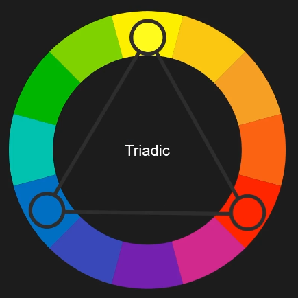

*Triadic*.

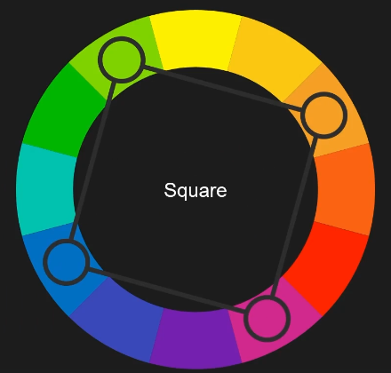

*Square*.

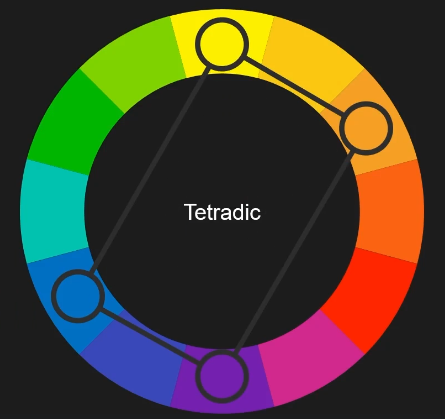

*Tetradic*.

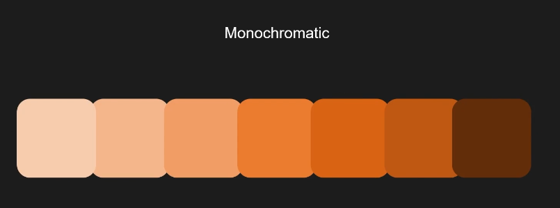

*Monochromatic*.

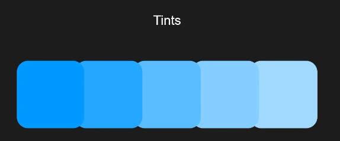

*Tints*.

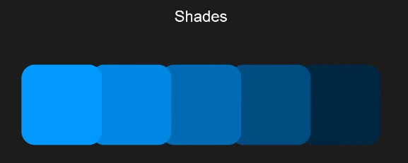

*Shades*.

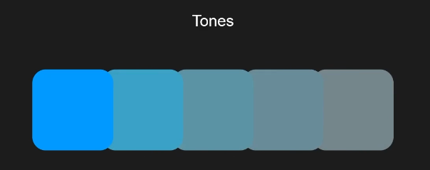

*Tones*.

## Color Website

- **Adobe Color** at `https://color.adobe.com`
  - Color Wheel at `https://color.adobe.com/pt/create/color-wheel`
  - Extract Theme at `https://color.adobe.com/pt/create/image`
- **Coolors** at `https://coolors.co/`
  - Color Contrast Checker at `https://coolors.co/contrast-checker`
- **ColorSpace** at `https://mycolor.space`

## Color Interactions

...
