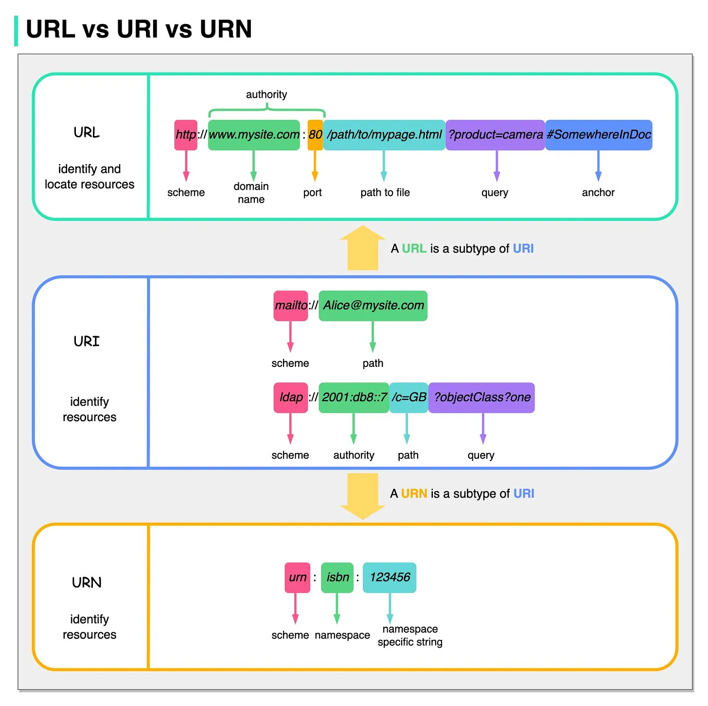

# Miscelaneous

## About

Tip & Tricks & Topics about IT

## TOC

- [URL vs URI vs URN](#url-vs-uri-vs-urn)

## URL vs URI vs URN



- **URI**: stands for ***Uniform Resource Identifier***. It identifies a logical or physical resource on the web. URL and URN are subtypes of URI. URL locates a resource, while URN names a resource.

A URI is composed of the following parts:

```text
scheme:[//authority]path[?query][#fragment]
```

- **URL**: stands for ***Uniform Resource Locator***, the key concept of HTTP. It is the address of a unique resource on the web. It can be used with other protocols like FTP and JDBC.

- **URN**:  stands for ***Uniform Resource Name***. It uses the urn scheme. URNs cannot be used to locate a resource. A simple example given in the diagram is composed of a namespace and a namespace-specific string.

If you would like to learn more detail on the subject, I would recommend W3C’s clarification.